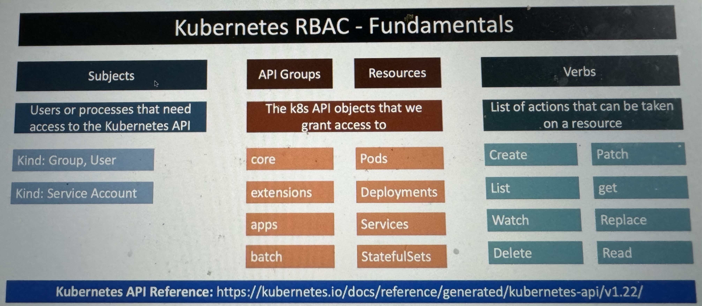

## Step-01: Introduction
- Implement and Test EFS Dynamic Provisioning Usecase

## Step-02: Project-03: Review Terraform Manifests
- **Project Folder:** 03-efs-dynamic-prov-terraform-manifests
1. c1-versions.tf
2. c2-remote-state-datasource.tf
3. c3-providers.tf
4. c4-01-efs-resource.tf

## Step-03: c4-02-storage-class.tf
- **Project Folder:** 03-efs-dynamic-prov-terraform-manifests
```t
# Resource: Kubernetes Storage Class
resource "kubernetes_storage_class_v1" "efs_sc" {  
  metadata {
    name = "efs-sc"
  }
  storage_provisioner = "efs.csi.aws.com"  
  parameters = {
    provisioningMode = "efs-ap"
    fileSystemId =  aws_efs_file_system.efs_file_system.id 
    directoryPerms = "700"
    gidRangeStart = "1000" # optional
    gidRangeEnd = "2000" # optional
    basePath = "/dynamic_provisioning" # optional
  }
}
```

## Step-04: Project-04: Review Terraform Manifests
- **Project Folder:** 03-efs-dynamic-prov-terraform-manifests
1. c4-03-persistent-volume-claim.tf
2. c5-write-to-efs-pod.tf
3. c6-01-myapp1-deployment.tf
4. c6-02-myapp1-loadbalancer-service.tf
5. c6-03-myapp1-network-loadbalancer-service.tf


## Step-05: Project-04: Execute Terraform Commands
```t
# Change Directory 
cd 03-efs-dynamic-prov-terraform-manifests

# Terraform Initialize
terraform init

# Terraform Validate
terraform validate

# Terraform Plan
terraform plan

# Terraform Apply
terraform apply -auto-approve
```

## Step-06: Verify Kubernetes Resources
```t
# Verify Storage Class
kubectl get sc

# Verify PVC (Persistent Volume Claim)
kubectl get pvc

# Verify PV (Persistent Volume)
kubectl get pv
```

## Step-07: Verify EFS File System, Mount Targets, Network Interfaces and Security Groups
```t
# Verify EFS File System
Go to Services -> EFS -> File Systems -> efs-demo

# Verify Mount Targets
Go to Services -> EFS -> File Systems -> efs-demo -> Network Tab

# Verify Network Interfaces
Go to Services -> EC2 -> Network & Security -> Network Interfaces -> GET THE ENI ID from Mount Targets

# Security Groups
Go to Services -> EC2 -> Network & Security -> Security Groups -> hr-dev-efs-allow-nfs-from-eks-vpc
```

## Step-08: Connect to efs-write-app Kubernetes pods and Verify 
```t
# efs-write-app - Connect to Kubernetes Pod
kubectl exec --stdin --tty <POD-NAME> -- /bin/sh
kubectl exec --stdin --tty efs-write-app  -- /bin/sh
cd /data
ls
tail -f efs-dynamic.txt
```

## Step-09: Connect to myapp1 Kubernetes pods and Verify 
```t
# List Pods
kubectl get pods 

# myapp1 POD1 - Connect to Kubernetes Pod
kubectl exec --stdin --tty <POD-NAME> -- /bin/sh
kubectl exec --stdin --tty myapp1-667d8656cc-2x824 -- /bin/sh
cd /usr/share/nginx/html/efs
ls
tail -f efs-dynamic.txt

# myapp1 POD2 - Connect to Kubernetes Pod
kubectl exec --stdin --tty <POD-NAME> -- /bin/sh
kubectl exec --stdin --tty myapp1-667d8656cc-bg8bg  -- /bin/sh
cd /usr/share/nginx/html/efs
ls
tail -f efs-dynamic.txt
```

## Step-10: Access Application
```t
# Access Application
http://<CLB-DNS-URL>/efs/efs-dynamic.txt
http://<NLB-DNS-URL>/efs/efs-dynamic.txt
```

## Step-11: Clean-Up
```t
# Change Directory
cd 03-efs-dynamic-prov-terraform-manifests

# Destroy Resources
terraform apply -destroy -auto-approve
rm -rf .terraform*
```


## Step-12: Clean-Up EKS Cluster, EFS CSI Driver
- Destroy the Terraform Projects in below two folders
- **Terraform Project Folder:** 01-ekscluster-terraform-manifests
- **Terraform Project Folder:** 02-efs-install-terraform-manifests
- We are going to use them for all upcoming Usecases.
- Destroy Resorces Order
  - 02-efs-install-terraform-manifests
  - 01-ekscluster-terraform-manifests
```t
##############################################################
## Delete EFS CSI Driver
# Change Directory
cd 02-efs-install-terraform-manifests

# Terraform Destroy
terraform init
terraform apply -destroy -auto-approve
##############################################################
## Destroy EKS Cluster
# Change Directroy
cd 01-ekscluster-terraform-manifests

# Terraform Destroy
terraform init
terraform apply -destroy -auto-approve
##############################################################
```


## References
- [AWS IAM OIDC Connect Provider](https://docs.aws.amazon.com/eks/latest/userguide/getting-started-console.html)
- [AWS EFS CSI Driver](https://docs.aws.amazon.com/eks/latest/userguide/efs-csi.html)
- [AWS Caller Identity Datasource](https://registry.terraform.io/providers/hashicorp/aws/latest/docs/data-sources/caller_identity)
- [HTTP Datasource](https://registry.terraform.io/providers/hashicorp/http/latest/docs/data-sources/http)
- [AWS IAM Role](https://registry.terraform.io/providers/hashicorp/aws/latest/docs/resources/iam_role)
- [AWS IAM Policy](https://registry.terraform.io/providers/hashicorp/aws/latest/docs/resources/iam_policy)
- [AWS EFS CSI Docker Images across Regions](https://docs.aws.amazon.com/eks/latest/userguide/add-ons-images.html)
- [To find latestEFS CSI Driver GIT Repo](https://github.com/kubernetes-sigs/aws-efs-csi-driver/)

